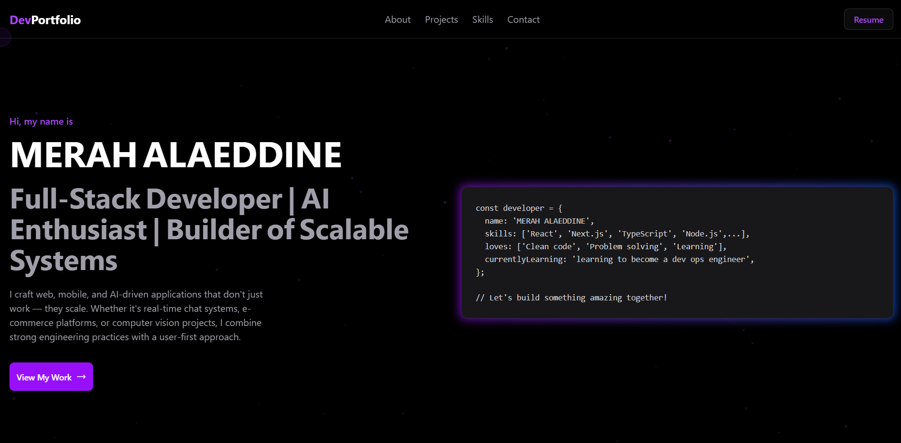
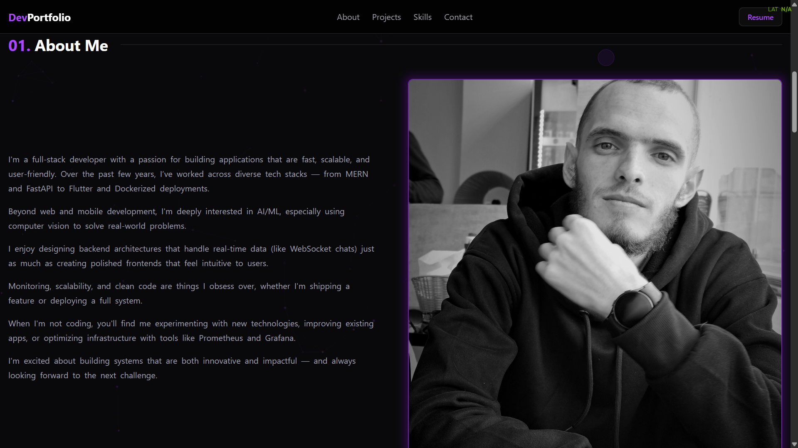
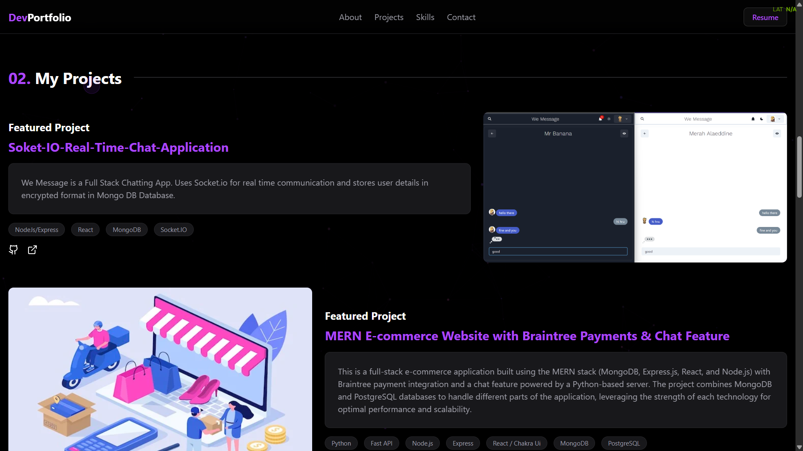
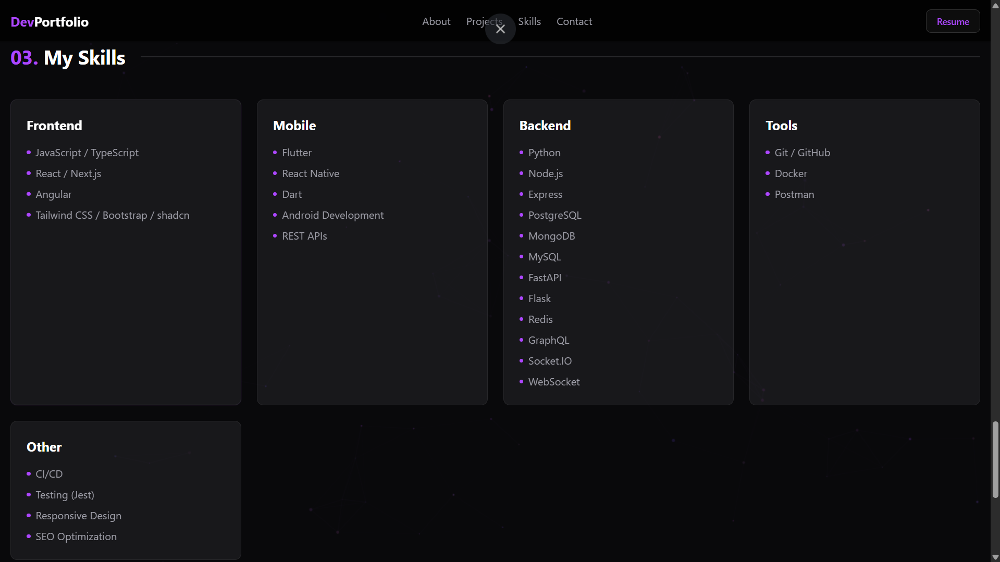
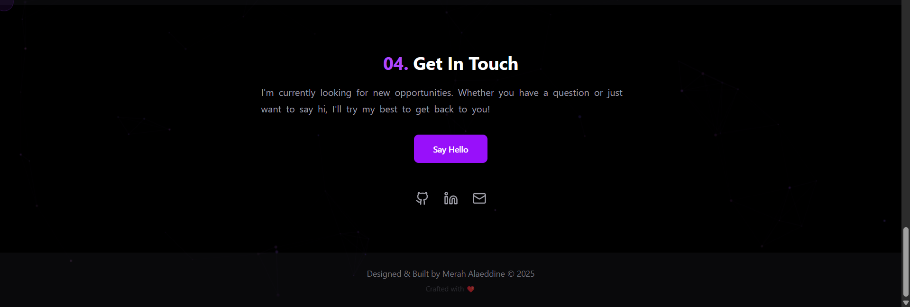

# Modern Portfolio Website


A modern, animated dark-themed portfolio website built with Next.js, TypeScript, Tailwind CSS, and Framer Motion. This portfolio template features advanced animations, interactive elements, and a responsive design.







## ✨ Features

- 🌙 **Modern Dark Theme** - Sleek dark design with purple accents
- 🎭 **Advanced Animations** - Powered by Framer Motion
- 🖱️ **Custom Cursor** - Interactive cursor follower
- ✨ **Particle Background** - Dynamic particle network
- 📱 **Fully Responsive** - Looks great on all devices
- 🎨 **Interactive Elements** - Hover effects and transitions
- 🧩 **Component-Based** - Modular and reusable components
- 🔍 **SEO Ready** - Optimized for search engines
- 🚀 **Performance Optimized** - Fast loading and smooth animations

## 🚀 Live Demo

[View Live Demo](https://your-portfolio-url.vercel.app)

## 🛠️ Technologies Used

- **Frontend Framework**: Next.js 13+ (App Router)
- **Language**: TypeScript
- **Styling**: Tailwind CSS
- **Animations**: Framer Motion
- **UI Components**: shadcn/ui
- **Icons**: Lucide React
- **Deployment**: Vercel (recommended)

## 📦 Installation

1. Clone the repository:

```bash
git clone https://github.com/DrLivesey-Shura/me
cd me
npm install
npm run dev
```
